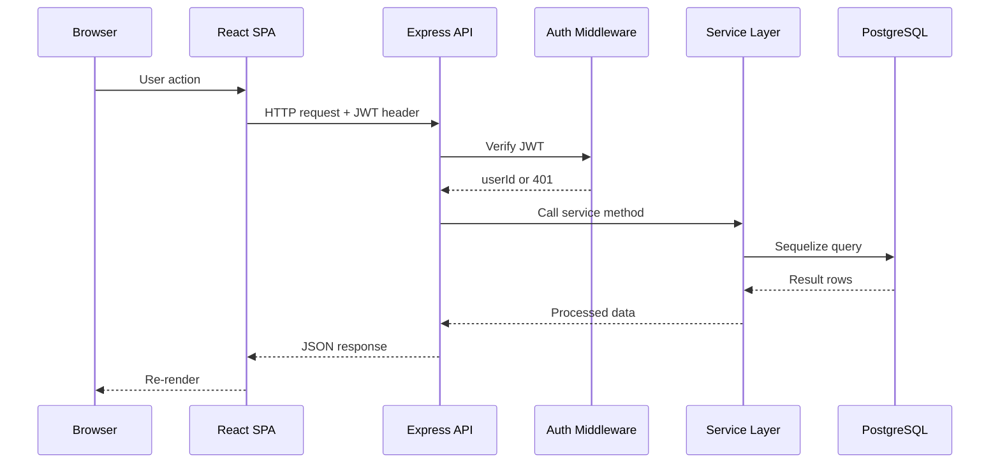
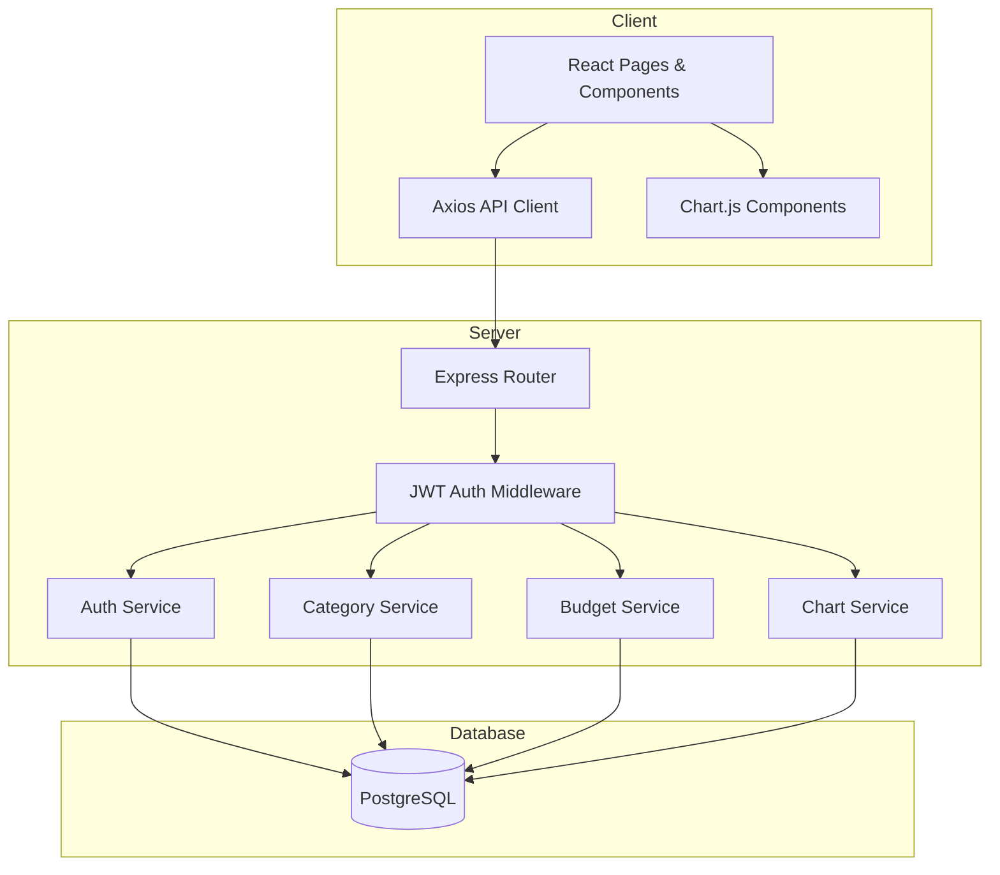
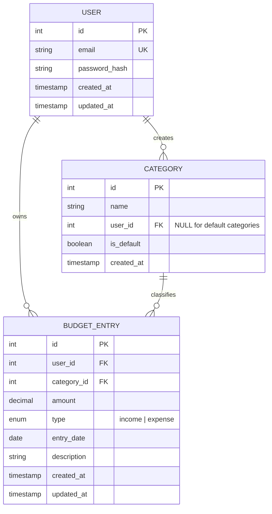

# Design Document: Budget Tracker

## Overview

The Budget Tracker is a full-stack web application that enables authenticated users to record, categorise, and visualise personal income and expense transactions. The system follows an MVC architecture with a RESTful JSON API backend and a single-page application (SPA) frontend.

**Core goals:**
- Secure, per-user data isolation enforced at every API layer
- Fast, responsive UI that works from 320 px to 2560 px viewports
- Rich data visualisations (pie, bar, line charts) that update reactively
- Clean separation of concerns: Auth, Category, Budget Entry, and Chart services

**Technology choices:**
- **Backend**: Node.js + Express.js — lightweight, well-understood, large ecosystem
- **Database**: PostgreSQL — relational model suits the structured financial data and foreign-key constraints needed for data integrity
- **ORM**: Sequelize — provides model-level validation, migrations, and query building
- **Authentication**: JSON Web Tokens (JWT) via `jsonwebtoken` + `bcrypt` for password hashing
- **Frontend**: React (Vite) — component model maps naturally to the dashboard/chart/form UI
- **Charts**: Chart.js via `react-chartjs-2` — mature library with pie, bar, and line support
- **Styling**: Tailwind CSS — utility-first, responsive breakpoints built in
- **Testing**: Jest + Supertest (backend), Vitest + React Testing Library (frontend), fast-check (property-based tests)

---

## Architecture

The application is split into two independently deployable packages inside a monorepo:

```
BudgetTracker/
├── server/          # Express API
│   ├── src/
│   │   ├── config/
│   │   ├── middleware/
│   │   ├── models/
│   │   ├── routes/
│   │   ├── services/
│   │   └── utils/
│   └── tests/
└── client/          # React SPA
    ├── src/
    │   ├── api/
    │   ├── components/
    │   ├── hooks/
    │   ├── pages/
    │   └── utils/
    └── tests/
```

### Request Flow



### High-Level Component Diagram



---

## Components and Interfaces

### Backend Services

#### Auth Service (`server/src/services/authService.js`)

| Method | Signature | Description |
|--------|-----------|-------------|
| `register` | `(email, password) → { user, token }` | Validates uniqueness, hashes password, creates user, returns JWT |
| `login` | `(email, password) → { user, token }` | Verifies credentials, returns 24-hour JWT |
| `hashPassword` | `(plaintext) → hash` | bcrypt hash with salt rounds = 12 |
| `verifyPassword` | `(plaintext, hash) → boolean` | bcrypt compare |
| `generateToken` | `(userId) → token` | Signs JWT with 24h expiry |
| `verifyToken` | `(token) → payload` | Verifies and decodes JWT |

#### Category Service (`server/src/services/categoryService.js`)

| Method | Signature | Description |
|--------|-----------|-------------|
| `getCategories` | `(userId) → Category[]` | Returns default + user-owned categories |
| `createCategory` | `(userId, name) → Category` | Creates user-scoped category, enforces uniqueness per user |
| `deleteCategory` | `(userId, categoryId) → void` | Deletes if no entries reference it; 409 otherwise |

#### Budget Service (`server/src/services/budgetService.js`)

| Method | Signature | Description |
|--------|-----------|-------------|
| `createEntry` | `(userId, data) → BudgetEntry` | Validates and persists a new entry |
| `getEntries` | `(userId, filters) → BudgetEntry[]` | Returns filtered, date-desc entries for user |
| `updateEntry` | `(userId, entryId, data) → BudgetEntry` | Validates ownership, updates fields |
| `deleteEntry` | `(userId, entryId) → void` | Validates ownership, deletes entry |

#### Chart Service (`server/src/services/chartService.js`)

| Method | Signature | Description |
|--------|-----------|-------------|
| `getExpensesByCategory` | `(userId, startDate, endDate) → PieData` | Aggregates expenses per category |
| `getMonthlyComparison` | `(userId) → BarData` | Income vs expenses for last 6 months |
| `getCumulativeBalance` | `(userId, startDate, endDate) → LineData` | Running net balance over time |
| `getDashboardSummary` | `(userId, startDate, endDate) → Summary` | Totals + top-5 expense categories |

### REST API Endpoints

#### Auth Routes (`/api/auth`)

| Method | Path | Auth | Description |
|--------|------|------|-------------|
| POST | `/api/auth/register` | No | Register new user |
| POST | `/api/auth/login` | No | Login, receive JWT |
| POST | `/api/auth/logout` | Yes | Client-side token invalidation |

#### Category Routes (`/api/categories`)

| Method | Path | Auth | Description |
|--------|------|------|-------------|
| GET | `/api/categories` | Yes | List user's categories |
| POST | `/api/categories` | Yes | Create category |
| DELETE | `/api/categories/:id` | Yes | Delete category |

#### Budget Entry Routes (`/api/entries`)

| Method | Path | Auth | Description |
|--------|------|------|-------------|
| GET | `/api/entries` | Yes | List entries with optional filters |
| POST | `/api/entries` | Yes | Create entry |
| PUT | `/api/entries/:id` | Yes | Update entry |
| DELETE | `/api/entries/:id` | Yes | Delete entry |

Query parameters for `GET /api/entries`:
- `startDate` (ISO 8601 date)
- `endDate` (ISO 8601 date)
- `categoryId` (integer)
- `type` (`income` | `expense`)

#### Dashboard / Chart Routes (`/api/dashboard`)

| Method | Path | Auth | Description |
|--------|------|------|-------------|
| GET | `/api/dashboard/summary` | Yes | Totals + top-5 categories |
| GET | `/api/dashboard/charts/pie` | Yes | Expense breakdown by category |
| GET | `/api/dashboard/charts/bar` | Yes | Monthly income vs expenses |
| GET | `/api/dashboard/charts/line` | Yes | Cumulative balance over time |

Query parameters: `startDate`, `endDate` (ISO 8601 dates).

### JWT Auth Middleware (`server/src/middleware/auth.js`)

Extracts the `Authorization: Bearer <token>` header, verifies the JWT, and attaches `req.userId` to the request. Returns 401 if the token is missing, malformed, or expired.

### Frontend Pages and Components

| Page / Component | Responsibility |
|-----------------|----------------|
| `RegisterPage` | Registration form, calls `/api/auth/register` |
| `LoginPage` | Login form, stores JWT in `localStorage` |
| `DashboardPage` | Hosts summary cards + all three charts |
| `EntriesPage` | Paginated entry list with filter controls |
| `EntryForm` | Create / edit modal for budget entries |
| `CategoryManager` | List, create, delete categories |
| `PieChart` | Wraps Chart.js pie chart |
| `BarChart` | Wraps Chart.js bar chart |
| `LineChart` | Wraps Chart.js line chart |
| `SummaryCard` | Displays a single KPI (income / expense / balance) |
| `PeriodSelector` | Date-range picker that drives dashboard queries |
| `NavBar` | Responsive navigation with hamburger at < 768 px |
| `ProtectedRoute` | HOC that redirects unauthenticated users to login |

---

## Data Models

### Entity Relationship Diagram



### Sequelize Model Definitions

#### User Model

```js
// server/src/models/User.js
{
  id:            { type: DataTypes.INTEGER, primaryKey: true, autoIncrement: true },
  email:         { type: DataTypes.STRING, allowNull: false, unique: true, validate: { isEmail: true } },
  password_hash: { type: DataTypes.STRING, allowNull: false },
  created_at:    DataTypes.DATE,
  updated_at:    DataTypes.DATE
}
```

#### Category Model

```js
// server/src/models/Category.js
{
  id:         { type: DataTypes.INTEGER, primaryKey: true, autoIncrement: true },
  name:       { type: DataTypes.STRING, allowNull: false },
  user_id:    { type: DataTypes.INTEGER, allowNull: true, references: { model: 'users', key: 'id' } },
  is_default: { type: DataTypes.BOOLEAN, defaultValue: false },
  created_at: DataTypes.DATE
}
// Unique constraint: (name, user_id) — prevents duplicate names per user
// Default categories have user_id = NULL and is_default = true
```

#### BudgetEntry Model

```js
// server/src/models/BudgetEntry.js
{
  id:          { type: DataTypes.INTEGER, primaryKey: true, autoIncrement: true },
  user_id:     { type: DataTypes.INTEGER, allowNull: false, references: { model: 'users', key: 'id' } },
  category_id: { type: DataTypes.INTEGER, allowNull: false, references: { model: 'categories', key: 'id' } },
  amount:      { type: DataTypes.DECIMAL(12, 2), allowNull: false, validate: { min: 0.01 } },
  type:        { type: DataTypes.ENUM('income', 'expense'), allowNull: false },
  entry_date:  { type: DataTypes.DATEONLY, allowNull: false },
  description: { type: DataTypes.STRING(500), allowNull: true },
  created_at:  DataTypes.DATE,
  updated_at:  DataTypes.DATE
}
```

### Default Categories Seed Data

The following categories are seeded at startup with `user_id = NULL` and `is_default = true`:

| Name | Type hint |
|------|-----------|
| Food | expense |
| Transport | expense |
| Housing | expense |
| Entertainment | expense |
| Healthcare | expense |
| Salary | income |
| Other | both |

### Filter Query Logic

The `getEntries` service method builds a dynamic Sequelize `where` clause:

```js
const where = { user_id: userId };
if (startDate) where.entry_date = { [Op.gte]: startDate };
if (endDate)   where.entry_date = { ...where.entry_date, [Op.lte]: endDate };
if (categoryId) where.category_id = categoryId;
if (type)       where.type = type;
// ORDER BY entry_date DESC
```

---


## Correctness Properties

*A property is a characteristic or behavior that should hold true across all valid executions of a system — essentially, a formal statement about what the system should do. Properties serve as the bridge between human-readable specifications and machine-verifiable correctness guarantees.*

The properties below were derived from the acceptance criteria using property-based testing (PBT) principles. Each property is universally quantified and implementable as an automated test using **fast-check** (backend) and **@fast-check/vitest** (frontend).

---

### Property 1: Registration round-trip

*For any* valid email address and password of at least 8 characters, calling the register endpoint should create a new user in the database and return a well-formed JWT.

**Validates: Requirements 1.2**

---

### Property 2: Duplicate email is rejected

*For any* email address that has already been registered, a second registration attempt with that same email should return a 409 Conflict response regardless of the password supplied.

**Validates: Requirements 1.3**

---

### Property 3: Short passwords are rejected

*For any* password whose length is between 1 and 7 characters (inclusive), the registration endpoint should return a 400 Bad Request response and no user should be created.

**Validates: Requirements 1.4**

---

### Property 4: Passwords are never stored in plaintext

*For any* registered user, the value stored in the `password_hash` column should not equal the original plaintext password, and `bcrypt.compare(plaintext, hash)` should return `true`.

**Validates: Requirements 1.5**

---

### Property 5: Login returns a 24-hour JWT

*For any* registered user, logging in with the correct password should return a JWT whose expiry (`exp`) is exactly 24 hours (86 400 seconds) after its issued-at time (`iat`).

**Validates: Requirements 2.1**

---

### Property 6: Invalid credentials are rejected

*For any* combination of (a) an email address that does not exist in the system, or (b) a registered email paired with an incorrect password, the login endpoint should return a 401 Unauthorized response.

**Validates: Requirements 2.2**

---

### Property 7: Custom category creation round-trip

*For any* valid category name submitted by an authenticated user, the category should be persisted and appear in that user's category list on subsequent retrieval.

**Validates: Requirements 3.2**

---

### Property 8: Duplicate category name is rejected per user

*For any* category name that already exists for a given user, a second creation attempt with the same name should return a 409 Conflict response.

**Validates: Requirements 3.3**

---

### Property 9: Empty category can be deleted

*For any* user-owned category that has no associated budget entries, requesting its deletion should succeed and the category should no longer appear in the user's category list.

**Validates: Requirements 3.4**

---

### Property 10: Category with entries cannot be deleted

*For any* category that has at least one associated budget entry, requesting its deletion should return a 409 Conflict response and the category should remain in the user's list.

**Validates: Requirements 3.5**

---

### Property 11: Budget entry creation round-trip

*For any* valid combination of amount (> 0), type (`income` | `expense`), category ID, and date, creating a budget entry should persist it and return a record whose fields match the submitted values and which carries a unique integer ID.

**Validates: Requirements 4.1**

---

### Property 12: Missing required fields are rejected

*For any* budget entry submission that omits at least one required field (amount, type, category, or date), the endpoint should return a 400 Bad Request response identifying the missing field(s).

**Validates: Requirements 4.2**

---

### Property 13: Non-positive amounts are rejected

*For any* amount value that is less than or equal to zero (including zero, negative integers, and negative decimals), the budget entry creation endpoint should return a 400 Bad Request response.

**Validates: Requirements 4.3**

---

### Property 14: Entries are returned in date-descending order

*For any* collection of budget entries with varying dates belonging to a user, retrieving those entries without filters should return them ordered by `entry_date` descending — i.e., for every adjacent pair in the result, the earlier element's date is ≥ the later element's date.

**Validates: Requirements 5.1**

---

### Property 15: Combined filters return the intersection of individual filters

*For any* set of budget entries and any combination of active filters (date range, category, type), the result of applying all filters simultaneously should be a subset of the result produced by each individual filter applied alone — i.e., every returned entry satisfies all active filter conditions.

**Validates: Requirements 5.2, 5.3, 5.4, 5.5**

---

### Property 16: Budget entry update round-trip

*For any* budget entry owned by the authenticated user and any valid set of updated field values, submitting the update should persist the new values and return a record whose fields match the submitted update.

**Validates: Requirements 6.1**

---

### Property 17: Owned entry deletion succeeds

*For any* budget entry owned by the authenticated user, requesting its deletion should return a 204 No Content response and the entry should no longer be retrievable.

**Validates: Requirements 6.4**

---

### Property 18: Dashboard totals are arithmetically correct

*For any* collection of income and expense entries within a selected period, the dashboard summary should report total income equal to the sum of all income entry amounts, total expenses equal to the sum of all expense entry amounts, and net balance equal to total income minus total expenses.

**Validates: Requirements 7.1**

---

### Property 19: Top-5 expense categories are correctly ranked

*For any* collection of expense entries distributed across N categories (N ≥ 1), the dashboard's top-5 list should contain the min(N, 5) categories with the highest total expense amounts, ordered by total amount descending.

**Validates: Requirements 7.3**

---

### Property 20: Pie chart data matches per-category expense totals

*For any* collection of expense entries across categories within a selected period, each slice in the pie chart dataset should have a value equal to the sum of amounts for that category, and the sum of all slice values should equal the total expenses for the period.

**Validates: Requirements 8.1**

---

### Property 21: Bar chart data matches monthly income/expense aggregations

*For any* collection of entries spanning up to 6 months, each bar group in the bar chart dataset should have income and expense values equal to the sum of income and expense entry amounts respectively for that calendar month.

**Validates: Requirements 8.2**

---

### Property 22: Line chart data represents correct cumulative balance

*For any* ordered sequence of budget entries within a selected period, each data point in the line chart should equal the running sum of (income amounts − expense amounts) from the start of the period up to and including that date.

**Validates: Requirements 8.3**

---

### Property 23: Protected endpoints reject unauthenticated requests

*For any* API endpoint that is not `/api/auth/register` or `/api/auth/login`, sending a request without a valid JWT (absent, malformed, or expired) should return a 401 Unauthorized response.

**Validates: Requirements 10.1**

---

### Property 24: User data is strictly isolated

*For any* two distinct authenticated users A and B, user B should receive a 403 Forbidden or empty result for every attempt to read, create, update, or delete budget entries or categories that belong to user A — regardless of the resource type or operation.

**Validates: Requirements 3.6, 4.4, 5.6, 6.2, 6.5, 10.4**

---

## Error Handling

### Backend Error Response Format

All API errors follow a consistent JSON envelope:

```json
{
  "error": {
    "code": "DUPLICATE_EMAIL",
    "message": "An account with this email address already exists.",
    "fields": ["email"]
  }
}
```

| HTTP Status | When Used |
|-------------|-----------|
| 400 Bad Request | Validation failures (missing fields, invalid values) |
| 401 Unauthorized | Missing, expired, or invalid JWT |
| 403 Forbidden | Authenticated but accessing another user's resource |
| 404 Not Found | Resource does not exist |
| 409 Conflict | Duplicate email, duplicate category name, category in use |
| 500 Internal Server Error | Unexpected server errors (logged, not exposed to client) |

### Validation Strategy

- **Input validation** is performed in Express route handlers using `express-validator` before reaching the service layer.
- **Business rule validation** (e.g., category in use, ownership checks) is performed in the service layer.
- **Database-level constraints** (unique indexes, foreign keys, NOT NULL) act as a final safety net.

### Frontend Error Handling

- API errors are caught in Axios interceptors and surfaced as toast notifications.
- 401 responses trigger automatic logout and redirect to `/login`.
- Form validation errors are displayed inline beneath the relevant field.
- Network errors display a generic "Something went wrong" message with a retry option.

### Logging

- Backend uses `winston` for structured JSON logging.
- All 5xx errors are logged with stack traces.
- Authentication failures are logged at `warn` level (without exposing credentials).
- Database query errors are logged at `error` level.

---

## Testing Strategy

### Overview

The project uses a dual testing approach: **example-based unit/integration tests** for specific scenarios and **property-based tests** for universal correctness guarantees.

### Backend Testing (Jest + Supertest + fast-check)

**Unit tests** cover:
- Service layer methods in isolation (mocked Sequelize models)
- JWT generation and verification utilities
- Input validation middleware
- Specific error conditions (404, 403, 409 responses)

**Property-based tests** cover all 24 correctness properties defined above. Each test:
- Uses `fast-check` arbitraries to generate random inputs
- Runs a minimum of **100 iterations** per property
- Is tagged with a comment referencing the design property:
  ```js
  // Feature: budget-tracker, Property 1: Registration round-trip
  ```

**Integration tests** cover:
- Full request/response cycle via Supertest against a test database
- Cross-user data isolation (Properties 24)
- Authentication enforcement across all protected endpoints (Property 23)
- Input sanitization with malicious payloads (XSS strings, SQL injection attempts)

### Frontend Testing (Vitest + React Testing Library + @fast-check/vitest)

**Unit tests** cover:
- Individual React components (form rendering, validation messages)
- Utility functions (date formatting, currency formatting)
- Chart data transformation functions

**Property-based tests** cover:
- Chart data computation properties (Properties 20, 21, 22) — pure transformation functions
- Filter intersection property (Property 15) — pure filter logic
- Dashboard totals computation (Property 18) — pure arithmetic

**Example-based tests** cover:
- Logout clears localStorage and redirects (Requirement 2.4)
- Expired JWT triggers redirect (Requirement 2.5)
- Empty chart state shows placeholder (Requirement 8.5)
- Hamburger menu appears at < 768 px (Requirement 9.3)
- Dashboard empty state shows zeros and prompt (Requirement 7.4)

### Test Configuration

```js
// fast-check configuration
fc.configureGlobal({ numRuns: 100, verbose: true });
```

### Test Database

- A separate PostgreSQL database (`budget_tracker_test`) is used for integration tests.
- Sequelize migrations are run before the test suite and the database is truncated between tests.
- A `testHelpers.js` module provides factory functions for creating test users, categories, and entries.

### Coverage Targets

| Layer | Target |
|-------|--------|
| Service layer (unit) | ≥ 90% |
| Route handlers (integration) | ≥ 85% |
| Frontend utilities | ≥ 90% |
| Frontend components | ≥ 75% |
